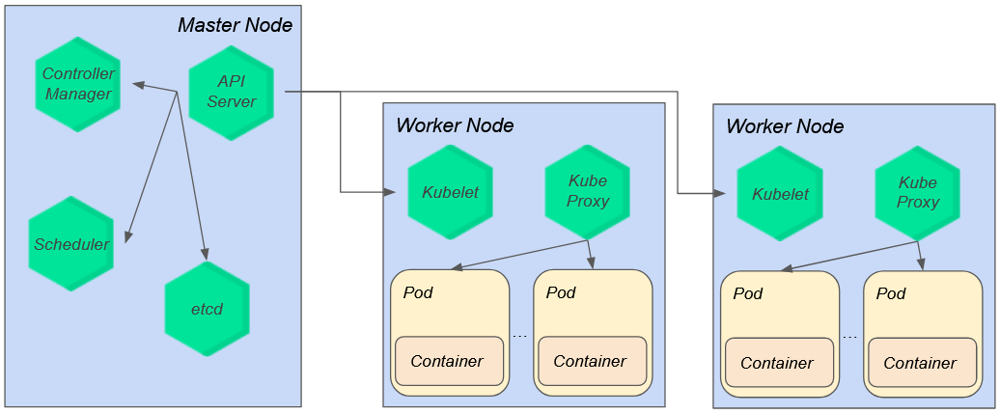

# Introduction to Kubernetes

## Docker

To understand the basics of Kubernetes is important to know the basics of Docker. All content describe below can be found in [Docker official documentation](https://docs.docker.com/get-started/overview/)

Docker is an open platform for developing, shipping, and running applications. Docker enables you to separate your applications from your infrastructure so you can deliver software quickly. With Docker, you can manage your infrastructure in the same ways you manage your applications. By taking advantage of Docker's methodologies for shipping, testing, and deploying code, you can significantly reduce the delay between writing code and running it in production.

There is three main concepts that we must understand in Docker basics:

1. Images: an image is a read-only template with instructions for creating a Docker container. Often, an image is based on another image, with some additional customization. For example, you may build an image which is based on the ubuntu image, but installs the Apache web server and your application, as well as the configuration details needed to make your application run.  
2. Containers: a container is a runnable instance of an image. You can create, start, stop, move, or delete a container using the Docker API or CLI. You can connect a container to one or more networks, attach storage to it, or even create a new image based on its current state.  
By default, a container is relatively well isolated from other containers and its host machine. You can control how isolated a container's network, storage, or other underlying subsystems are from other containers or from the host machine.  
A container is defined by its image as well as any configuration options you provide to it when you create or start it. When a container is removed, any changes to its state that aren't stored in persistent storage disappear.  
3. Registry: a Docker registry stores Docker images. Docker Hub is a public registry that anyone can use, and Docker looks for images on Docker Hub by default. You can even run your own private registry.  

### Hands on

At this example we create a simple Golang app that runs a web server with a /hello route.
We're going to build this image and run in a docker container to understand the basics.  
ps: all files are located in `docker-example` directory

Ensure that you have Docker installed, if not you can download [here](https://www.docker.com/products/docker-desktop/).  

#### Create simple web server

Before jump into image building we need to write a simple web server as described.  

. create a file `main.go` and copy this code into it

```go
package main

import (
	"fmt"
	"net/http"
)

func helloHandler(w http.ResponseWriter, _ *http.Request) {
	fmt.Fprint(w, "Hello World")
}

func main() {
	http.HandleFunc("/hello", helloHandler)

	fmt.Println("Server is running on http://localhost:8080/hello")
	http.ListenAndServe(":8080", nil)
}
```

##### Create Dockerfile

Now we can create a Dockerfile that will contains the instructions to create the image.  

. create a file `Dockerfile` and copy this code into it

```dockerfile
FROM golang:1.21.3-alpine3.18

WORKDIR /app
COPY . .
RUN go build -o main .

EXPOSE 8080

CMD ["./main"]
```

At the same directory that you have this files, you can run the `docker build` command described below to generate the `docker-example` image.

```sh
docker build -t docker-example .
```

You can check your images with

```sh
docker images
```

#### Run a container

With the image we will be able to create and run a new container to execute it.

```sh
docker run --rm --name my-docker-example -p 8080:8080 docker-example
```

Note that we are exposing port 8080 from container in host 8080 (-p 8080:8080 option). Without this the web server will be unreachable from host.
The --rm flag automatically remove the container when exits.

After run the container we will be able to check basic informations about it with

```sh
docker ps
```

To access your application you can execute a simple `curl` command to `localhost:8080/hello` as described

```sh
curl localhost:8080/hello
```

We expect the following answer.

```sh
Hello World%
```

If we execute the container without exposing the port as mentioned before, than we will have some problems

```sh
docker run --rm --name my-docker-example docker-example
```

```sh
curl localhost:8080/hello
curl: (7) Failed to connect to localhost port 8080 after 5 ms: Couldn't connect to server
```

#### Running a shell inside an existing container

It is possible to access the shell inside the container that is running your application with the following command:

```sh
docker exec -it my-docker-example /bin/sh
```

The process that is running the shell have the same Linux namespaces as the main container proccess. This make possible to us explore the container and see how our app is running.  
Each container has an isolated process tree, and also an isolated filesystem. Checking container processes will ensure to us the process tree isolation.

```sh
/app # ps -ef
PID   USER     TIME  COMMAND
    1 root      0:00 ./main
   11 root      0:00 /bin/sh
   17 root      0:00 ps -ef
```

Listing contents from root directory inside the container show to us about filesystem isolation.  

```sh
/ # ls
app    dev    go     lib    mnt    proc   run    srv    tmp    var
bin    etc    home   media  opt    root   sbin   sys    usr
```

#### Stop and delete containers

When we need to stop a container we can execute

```sh
docker stop my-docker-example
```

If you run the container without `--rm` option you can delete the container with

```sh
docker rm my-docker-example
```

If we want to push the generated image to any registry we can execute a `docker push` command. This will allows anyone to pull this image from the registry if have access.

## Kubernetes

Kubernetes is an open-source platform that enables the automation, management, and scalability of containerized applications, commonly used with Docker.  

The architecture of Kubernetes, as described in [documentation](https://kubernetes.io/pt-br/docs/concepts/overview/components/) can be seen in figure below. It consists of different components that work together to provide a resilient and scalable environment. When using Kubernetes, we deal with a Kubernetes cluster, which is a set of processing servers called nodes. Pods will be hosted on these servers, where the application will run. There are two types of nodes: the Master Node, responsible for making scalability decisions and managing cluster resources, and the Worker Nodes, responsible for hosting applications. Every Kubernetes cluster has at least one Worker Node.  



The Kubernetes Master Node is composed of three main components: the API server, which exposes the Kubernetes API and serves as the entry point for all services; the Scheduler, responsible for monitoring newly created pods that have not been assigned to a node yet and selecting a suitable node for their execution; and the Controller Manager, tasked with managing the cluster's controllers, ensuring proper cluster state maintenance.  

The Kubernetes Worker Node also consists of three main components: the Kubelet, an agent running on each node that ensures containers are running in a pod; the Kube Proxy, a network proxy responsible for maintaining network rules and enabling communication with pods both inside and outside the cluster; and the Container Runtime, the software responsible for running containers, such as Docker.  

Finally, the Kubernetes architecture includes Etcd, a consistent and highly available key-value store used for all cluster data.  

### Concepts

Next, let's define the concept of a *pod*, understand what it represents, and explore the available options for *workload resources* and services in Kubernetes.

In the context of Kubernetes, the [pod](https://kubernetes.io/docs/concepts/workloads/pods/) represents the smallest deployable unit under our control for creation and management. In its typical configuration, a *pod* consists of a single container; however, in situations involving applications composed of multiple interconnected containers, the *pod* can encompass several containers. This possibility arises due to the sharing of network and storage resources among all containers contained in the *pod*. It's worth noting that *pods* in Kubernetes are ephemeral by nature, meaning they can be created, deleted, and recreated dynamically to adapt to application demands.

Normally, *pods* are not created directly as a resource in Kubernetes but are instead created from *workload resources*. A [workload resource](https://kubernetes.io/docs/concepts/workloads/) is basically an automated way of managing a set of *pods*. Kubernetes provides us with some *workload resources*:

- **Deployment**: Manages stateless applications where the state is not saved, and each transaction can be interpreted as starting from scratch.
- **StatefulSet**: Manages stateful applications where state persistence is required.
- **DaemonSet**: Ensures a specific copy of a *pod* runs on each node of the cluster. In case new nodes are added to the cluster, this *workload* guarantees that a new *pod* will appear on the new node of the cluster.
- **Job and CronJob**: *Job* provides a way to execute tasks that run once and are completed. For scenarios where the same *Job* needs to be executed multiple times according to a schedule, we can use *CronJob*.

To expose an application from a set of *pods* as a network service, Kubernetes provides the *Service* resource. With it, we can define a logical set of *pods* and a stable way to access them. The *service* makes it possible to expose this set not only internally to the cluster but also externally if necessary. Kubernetes provides us with the following types of *service*:

- **ClusterIP**: Allocates an internal IP, making the set of *pods* accessible only internally within the cluster.
- **NodePort**: Exposes the service on a fixed port of each cluster node, making it accessible from the cluster node's IP on the configured port.
- **LoadBalancer**: Exposes the service externally using an external load balancer. Note that Kubernetes does not provide a load balancer component; you need to provide one, commonly offered in public cloud clusters such as GCP.
- **ExternalName**: Maps the service to a specified Domain Name System (DNS).

### Autoscaling

Autoscaling aims to dynamically adjust processing resources based on the application's demand. This approach ensures that more resources are allocated during peak demand and deallocated during idle times. Thus, it guarantees high availability for the application and optimization of the resources used.

The autoscaling process consists of four distinct phases. The first phase is monitoring, where a system is used to collect data about the monitored resources. Next, this data is analyzed by the autoscaling system, which uses a predefined rule to plan an action to be executed. The granularity and quality of the monitoring data have a direct impact on the performance of the autoscaling system, so it is crucial that the collected data for analysis is reliable and readily available.

Kubernetes provides three possibilities for autoscaling:

- **Horizontal Pod Autoscaler (HPA):** Adds new pods that run the same application, balancing the load across more processing units. Since only new pods need to be added, there is no need to restart the running application, making HPA attractive for applications requiring high availability.

- **Vertical Pod Autoscaler (VPA):** Directly changes the resources of existing pods. As it is necessary to modify the available resources in existing pods, a service restart is required, hindering the use of VPA for applications requiring high availability.

- **Cluster Autoscaler (CA):** Increases the number of nodes in the Kubernetes cluster when it is no longer possible to allocate pods on existing nodes. It is commonly used by public clouds that provide Kubernetes clusters, such as GCP (Google Cloud Platform).


### ref
[https://github.com/knrt10/kubernetes-basicLearning](https://github.com/knrt10/kubernetes-basicLearning)
